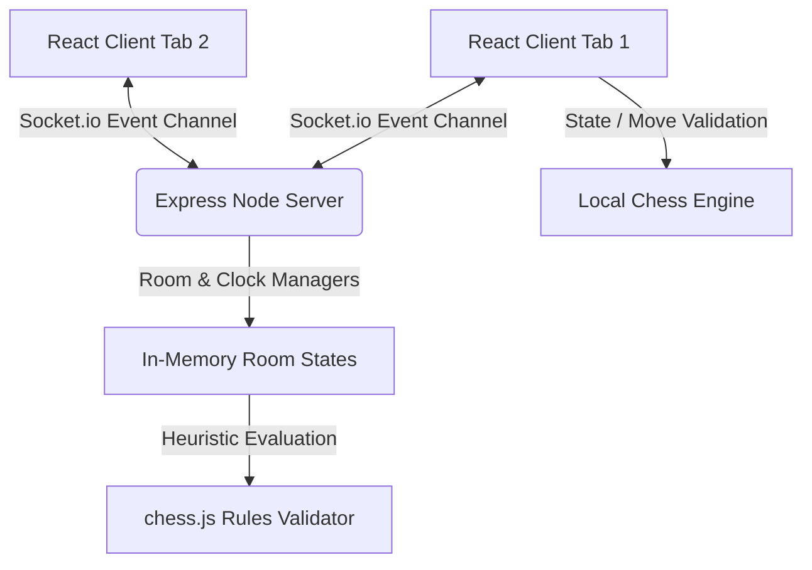

# ♟️ Classic Chess — Online & Offline Multiplayer

An elegant, fully-featured, and highly responsive modern web implementation of Chess. Play offline against an adaptive Minimax AI, pass-and-play with a friend locally, or host real-time multiplayer lobbies over WebSockets.


---

## 🌟 Key Features

*   **🎮 Three Play Modes**:
    *   **1 Player vs Bot**: Play against a Minimax-driven AI engine featuring configurable search depths (Easy, Medium, Hard) and position-evaluation heuristic matrices.
    *   **Local 2 Player**: Pass-and-play with a friend on a single screen.
    *   **Online Multiplayer**: Host customizable game rooms, invite friends via generated share links, select/swap player colors in the lobby, and play in real-time.
*   **🤝 Interactive Match Lobby**: Custom color selection and host-controlled manual start prevents desynchronized or premature gameplay.
*   **🔔 Real-time Visual Turn Indicator**: Dynamic banners highlight who is active (Green pulsing indicators on your turn, gray waiting badges, and black/white indicators for local/spectator screens).
*   **🔊 Synthesized Sound Effects**: Built-in sound generator uses the browser's native **Web Audio API** to synthesize retro 8-bit cues for moves, captures, checks, and victories.
*   **🎨 Custom Board Themes**: Choose your favorite aesthetic from four premium pre-configured color palettes (Classic Wood, Modern Slate, Midnight Gold, Forest Green).
*   **📱 Fully Fluid Responsive Design**: Tailored layout modifications dynamically adapt the board and dashboards between desktop views and stacked mobile interfaces.
*   **👁️ Spectator Slots**: Allow unlimited users to join existing active rooms to view real-time matches as spectators.
*   **💬 Integrated Chat Room**: Send quick messaging presets, text chat, or float emoji reactions that display directly in the game feed.
*   **⏮️ Game Control Prompts**: Interactive request dialogs support offering draws, requesting match restarts, and undoing last-moves synchronously.

---

## 🛠️ Technology Stack

*   **Frontend**: React (with standard hooks, Refs for socket lifecycle cleanup, and optimized component splits)
*   **Bundler**: Vite
*   **Styling**: Modern CSS variables & HSL-tailored premium color grids
*   **Backend**: Node.js & Express
*   **Real-time Communication**: WebSockets via Socket.io
*   **Chess Engine**: `chess.js` (for validating legal moves, checkmates, stalemates, and draws)
*   **Icons**: Lucide React

---

## 🏗️ Architecture Design



---

## 🚀 Getting Started

### 📋 Prerequisites
Make sure you have [Node.js](https://nodejs.org) (v18 or higher) installed on your system.

### ⚙️ Installation
1. Clone this repository (or download the source directory).
2. Install the package dependencies:
   ```bash
   npm install
   ```

### 💻 Run Locally in Development Mode
Vite supports hot-module replacement (HMR). Run the development servers in parallel:

1. **Start the Socket.io Backend Server**:
   ```bash
   npm run server
   ```
   *The server will start listening on port `3001`.*

2. **Start the Frontend Dev Server**:
   ```bash
   npm run dev
   ```
   *Open the browser on the logged URL (usually `http://localhost:5173`).*

---

## 📦 Production Deployment

To bundle the application and host the server in a production environment:

1. Build the frontend production assets:
   ```bash
   npm run build
   ```
   *This compiles the React code and styles into the `dist/` directory.*

2. Start the production server:
   ```bash
   npm start
   ```
   *The Node server will host the Express API, manage Socket connections on port `3001`, and serve the compiled static files from `dist/` at the root path.*

---

## 📐 AI Evaluation Engine

The **vs Bot** engine uses a standard **Minimax search algorithm** with **alpha-beta pruning**. It scores board states using:
- **Material weights**: Pawn (10), Knight (30), Bishop (30), Rook (50), Queen (90), King (9000).
- **Piece-Square tables**: Positional matrices reward knights for staying in the center, pawns for advancing, and kings for maintaining safety in the castle during the mid-game, while encouraging active king play in the endgame.

---

## 📄 License
This project is open-source and available under the MIT License.
